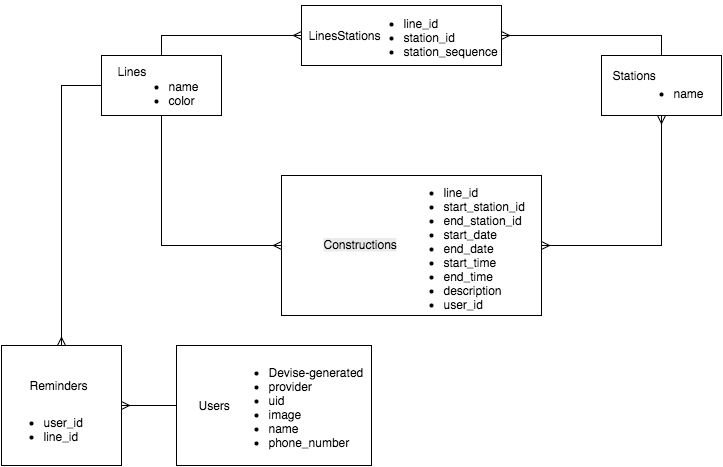

# Introduction

On my way, T is MBTA construction reminders web application hosted at http://onmyway-t.herokuapp.com/.  The application was designed and built as a breakable toy during the Fall 2015 cohort at Launch Academy (http://www.launchacademy.com/).

 

# ER Diagram

